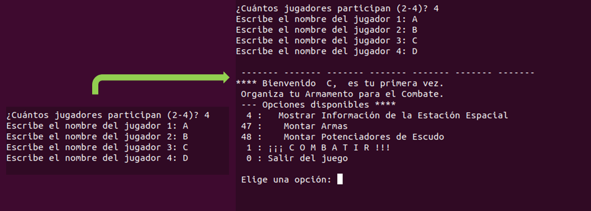

# DeepSpace

## Description


Game which simulates an intergalatic war. 

- __Objective:__ Earn the maximum number of __medals__. 

- __Features__: 
	1. __Spacial stations__. They have different features, such as number of medals obtained, available fuel and shield energy level.
	2. __Warships__. 
	3. __Battle__. This simulates the battle between different warships. 


## Dependencies

The code has been executed in Ubuntu 20.04 with the following programmes: 

- __Ruby__. A Ruby interpreter only. Ruby's version is simple and just requires
a prompt in shell to show terminal-based interface. 

- __Java__. NetBeans 17 + OpenJDK 11.0.18. 

## Build (Linux)

- __Ruby__. The Ruby version of the game is a terminal-based interface. Write 
the following command from current directory of README to execute the game:

```bash
ruby Ruby/PlayWithUI.rb
```

- __Java__. Open the folder _Java_ in Netbeans. To build the project, click on
_Run/Build Project_ in Netbeans interface. 


## Example

- __Ruby__. The output of the game consists of a simple terminal-based system:




- __Java__. The output consists of a name screen and a main panel: 


